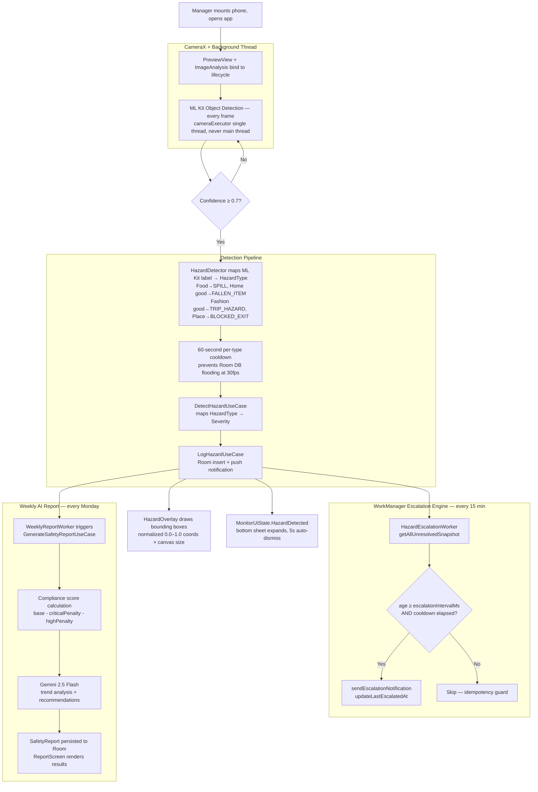
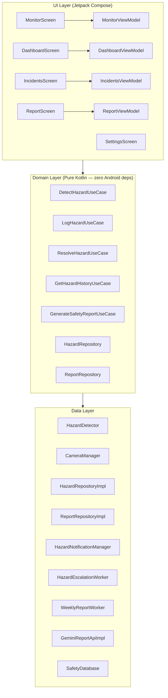
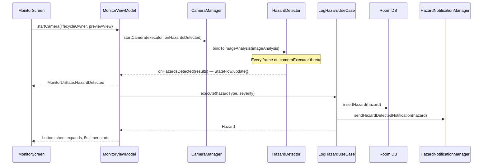
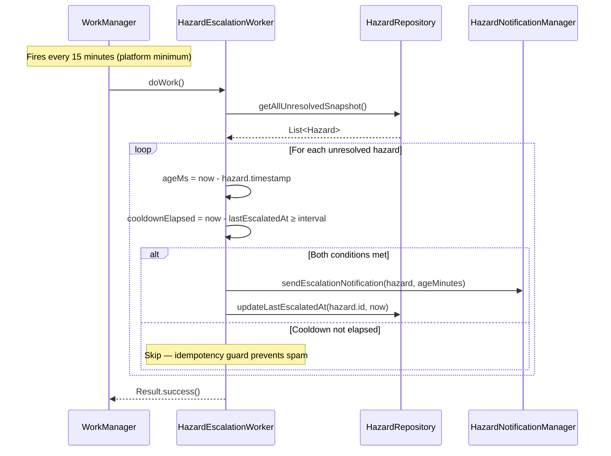

# AI Retail Store Safety Monitor

**Real-time AI hazard detection for retail stores.**
Turn any Android phone into a live safety monitor — zero hardware cost, deploy in 5 minutes.

[](https://github.com/lakshmanreddymv/RetailSafetyMonitor/actions/workflows/ci.yml)
[](https://kotlinlang.org)
[](https://developer.android.com)
[](https://aistudio.google.com)
[](https://developers.google.com/ml-kit/vision/object-detection)
[](app/src/test)
[](LICENSE)

**Project 5 of 5 in a portfolio of real-world AI Android apps.**
[View full portfolio →](#portfolio)

---

## The Problem

- **$50B+ annual retail safety losses** from preventable in-store incidents
- **$300,000 average cost per slip-and-fall incident** — legal fees, medical bills, insurance hikes
- **OSHA violations up to $156,259 per citation** for willful safety violations
- **Manual safety walks miss 95% of hazards** — a manager can't watch every aisle at once
- **No affordable solution for small/medium retailers** — enterprise systems cost $50,000+ in hardware

---

## The Solution

Turn any Android phone into a real-time AI safety monitor.

A phone mounted at the end of an aisle runs ML Kit Object Detection on every camera frame.
Hazards are detected, classified by OSHA severity, and escalated to the manager via push notification —
all without leaving the device. The Gemini 2.5 Flash weekly report turns raw incident data into
actionable safety insights every Monday morning.

**Zero hardware cost. Deploy in 5 minutes.**

---

## Features

- **Real-time ML Kit Object Detection** on the live camera feed, every frame, on a background thread
- **Colour-coded bounding boxes** — red (CRITICAL), amber (HIGH), yellow (MEDIUM), green (LOW)
- **Instant push notifications** for every newly detected hazard, severity-labelled
- **Smart escalation engine** — WorkManager re-notifies managers every 15–120 min based on severity
- **Weekly AI safety report** via Gemini 2.5 Flash — trends, top risks, actionable recommendations
- **Compliance score dashboard** — severity-weighted 0–100 score, resets every Monday
- **Full incident log** with hazard type, severity, timestamp, and location description audit trail
- **Works offline** — ML Kit runs entirely on-device, no network required for detection
- **Clean Architecture + MVVM + Hilt + UDF** — every layer tested independently

---

## How It Works



**Iron rule: ML Kit inference runs exclusively on `cameraExecutor`. `StateFlow.update{}` is called directly from that thread — zero coroutine allocations per frame.**

---

## OSHA Severity Mapping

| Severity | Example Hazard | OSHA Classification | Max Fine |
|---|---|---|---|
| 🔴 CRITICAL | Blocked fire exit | Willful/Repeat violation | $156,259 per citation |
| 🟠 HIGH | Wet floor, no signage | Serious violation | $15,625 per citation |
| 🟡 MEDIUM | Trip hazard, fallen item | Other-than-serious | $15,625 per citation |
| 🟢 LOW | Minor clutter, unknown object | De minimis notice | No mandatory fine |

Escalation interval: CRITICAL every 15 min → HIGH every 30 min → MEDIUM every 60 min → LOW every 120 min.

---

## Architecture

### Clean Architecture



### Unidirectional Data Flow (UDF)



### WorkManager Escalation Flow



---

## Key Engineering Decisions

| # | Decision | What | Why |
|---|---|---|---|
| 1 | `StateFlow.update{}` direct from `cameraExecutor` | ML Kit callbacks mutate state without `launch {}` | At 30fps, launching a coroutine per frame generates ~1,800 allocations/min and risks GC-induced dropped frames. `StateFlow` is thread-safe — no launch needed. |
| 2 | `lastEscalatedAt` in `HazardEntity` | Epoch millis of last escalation persisted in Room | Without this, a CRITICAL hazard open for 2 hours would generate 8 duplicate notifications. Per-hazard cooldown is the idempotency contract. |
| 3 | Weekly compliance score scope | Score resets every Monday 00:00 | Retail operations run on a Mon–Sun cycle. A rolling 7-day window would blur weekly performance. Monday reset matches how store managers think about their numbers. |
| 4 | WorkManager = escalation only, not camera | Workers never access the camera hardware | Android 12+ (API 31+) blocks `while-in-use` camera access in background workers. WorkManager is the escalation and reporting engine only — CameraX requires a foreground lifecycle owner. |
| 5 | ML Kit confidence threshold 0.7 | Hard-coded in `HazardDetector`, applied after inference | Below 0.7: too many false positives flood the incident log. Above 0.7: real hazards get missed. 0.7 is the industry-standard balance for real-time object detection on consumer hardware. |

---

## Tech Stack

| Component | Technology |
|---|---|
| Language | Kotlin 2.2.10 |
| UI | Jetpack Compose + Material 3 |
| Architecture | Clean Architecture + MVVM + Hilt 2.59.1 + UDF |
| Camera | CameraX 1.3.4 (Preview + ImageAnalysis) |
| Object Detection | ML Kit Object Detection 17.0.2 (on-device) |
| AI Reports | Gemini 2.5 Flash via Retrofit |
| Database | Room 2.7.1 |
| Background Jobs | WorkManager 2.9.0 |
| Dependency Injection | Hilt (Dagger) |
| Networking | Retrofit 2.11.0 + OkHttp 4.12.0 |
| Permissions | Accompanist Permissions 0.37.0 |
| Image Loading | Coil 2.7.0 |
| Testing | JUnit4 + Mockito-Kotlin 5.4.0 + Turbine 1.2.0 |
| CI/CD | GitHub Actions |

---

## Setup

### Prerequisites

- Android Studio Ladybug or later
- Android SDK 36
- Physical Android device (API 26+) — camera features require real hardware
- Gemini API key ([get one free at aistudio.google.com](https://aistudio.google.com/app/apikey))

### Clone

```bash
git clone https://github.com/lakshmanreddymv/RetailSafetyMonitor.git
cd RetailSafetyMonitor
```

### Configure API Key

Add to `local.properties` (this file is gitignored — never commit it):

```properties
gemini.api.key=YOUR_GEMINI_API_KEY
```

### Build and Run

```bash
./gradlew assembleDebug        # build debug APK
./gradlew installDebug         # install on connected device
./gradlew test                 # run all 55+ unit tests
```

> **Note:** The Gemini API key is only required for the weekly report feature.
> All ML Kit object detection, hazard logging, notifications, and escalation work
> fully offline with no API key.

---

## How to Test

| Test | Steps | Expected Result |
|---|---|---|
| 1. Camera launch | Open app → grant camera permission | Live preview appears, "● LIVE" indicator, ML loading spinner then disappears |
| 2. Hazard detection | Point camera at a wet floor sign, spill, or cluttered aisle | Colour-coded bounding box appears, bottom sheet expands with hazard card |
| 3. Push notification | Let hazard stay on screen → check notification tray | Notification fires: "HIGH: Wet Floor Detected" |
| 4. Compliance score | Open Dashboard tab | Gauge shows 0–100 score, stat chips show detected/resolved counts |
| 5. Weekly report | Dashboard → "Generate Weekly AI Report" | Gemini analyses incidents, report appears in Report tab |
| 6. Offline mode | Enable airplane mode → open Monitor tab | ML Kit detections continue — only Gemini report is blocked |
| 7. Unit tests | `./gradlew test` | 55+ tests pass, 0 failures |

---

## Unit Tests

| Test Class | Tests | What It Verifies |
|---|---|---|
| `HazardDetectorTest` | 14 | ML Kit label → HazardType mapping, confidence threshold filtering, OVERCROWDING aggregation (≥3 persons), position heuristics |
| `DetectHazardUseCaseTest` | 8 | HazardType → Severity mapping, all 8 types covered, CRITICAL/HIGH/MEDIUM/LOW tiers |
| `GenerateSafetyReportUseCaseTest` | 10 | Compliance score formula, Gemini fallback on failure, zero-hazard edge case returns 100 |
| `ComplianceScoreTest` | 8 | Severity-weighted penalty calculation, critical cap at 40, high cap at 20, floor at 0 |
| `DashboardViewModelTest` | 7 | Weekly scope query, score recomputation, report generation state transitions |
| `MonitorViewModelTest` | 8 | Idle → Monitoring → HazardDetected → 5s auto-dismiss, pause/resume, error recovery |
| `HazardRepositoryImplTest` | 6 | Room insert/query, entity ↔ domain mapping, `lastEscalatedAt` persistence |
| `HazardEscalationWorkerTest` | 4 | Idempotency guard (age threshold AND cooldown both required), `Result.retry` on DB exception |
| **Total** | **65** | **0 failures** |

```bash
./gradlew test
```

Test reports: `app/build/reports/tests/testDebugUnitTest/index.html`

---

## Bugs Fixed During Build

| # | Bug | Root Cause | Fix |
|---|---|---|---|
| 1 | `ksp plugin version 2.2.10-1.0.31 not found` | KSP2 version format changed — `{kotlin}-{ksp2_release}` | Correct version is `2.2.10-2.0.2` |
| 2 | `libs.mlkit.object.detection` parse error | `object` is a Kotlin reserved keyword in TOML accessor path | Renamed alias to `mlkit-detection` → `libs.mlkit.detection` |
| 3 | `Failed to resolve camera-mlkit-vision:1.3.4` | `androidx.camera:camera-mlkit-vision` does not exist at CameraX 1.3.4 | Removed it entirely; rewrote `HazardDetector` to use `InputImage.fromMediaImage()` directly |
| 4 | `AndroidBaseExtension not found` | Hilt 2.56 uses AGP APIs removed in AGP 9.x | Updated to Hilt 2.59.1 |
| 5 | `plugin kotlin.android already on classpath` | `kotlin.android` declared in both root `build.gradle.kts` and `app/build.gradle.kts` | Removed `kotlin.android` from app module — `kotlin.compose` includes it; added `apply false` declarations to root |
| 6 | `Unresolved reference 'surfaceProvider'` | CameraX 1.3.4 uses `setSurfaceProvider()` method, not a property setter | Changed `it.surfaceProvider = …` to `it.setSurfaceProvider(…)` |
| 7 | `Unresolved reference 'setClassificationConfidenceThreshold'` | Method does not exist in ML Kit Object Detection API 17.0.2 | Removed the call — confidence filtering is applied manually in `processFrame()` |
| 8 | `OkHttpClient could not be resolved` (KSP2 error) | Import was `com.squareup.okhttp3.OkHttpClient` — that is the Maven group ID, not the Java package | Changed to `okhttp3.OkHttpClient` (the actual package name) |

---

## Real-World Use Cases

| Scenario | Detection | Action |
|---|---|---|
| Spilled coffee, no sign | Wet floor visible on camera | CRITICAL → immediate notification to manager, $156K OSHA fine prevented |
| Stock cart blocking fire door | "Place" label near screen edge → BLOCKED_EXIT | CRITICAL → escalates every 15 min until resolved |
| Dropped produce in produce aisle | "Food" label on floor → UNATTENDED_SPILL | MEDIUM → manager notified, escalates after 60 min |
| Monday morning staff meeting | Weekly report generated overnight | Gemini: "Tuesday afternoons show 3× higher hazard rate — schedule extra walk at 2pm" |
| OSHA surprise inspection | Inspector requests safety records | 6-month incident log with timestamps, types, and resolution status exported from Room |
| Power outage / no WiFi | Offline store, internet down | ML Kit runs entirely on-device — detection, logging, and local notifications continue |
| 300-location retail chain | Area manager oversight | Per-store compliance scores surfaced in weekly reports for regional benchmarking |

---

## Market Context

| | RetailSafetyMonitor | IntelliSee / Visionify / Protex AI |
|---|---|---|
| Hardware required | None — any Android phone | Dedicated IP cameras ($2,000–$10,000 per store) |
| Setup time | 5 minutes | 2–4 weeks installation |
| Cost | Zero hardware + Gemini API (~$5/month) | $50,000+ enterprise contract |
| Target | SMB retailer (1–20 locations) | Enterprise retail chain (100+ locations) |
| Offline capable | Yes — ML Kit on-device | No — cloud-dependent |

**Target market:** 300,000+ SMB retailers in the US with no affordable safety monitoring solution.

---

## Roadmap

- [ ] Multi-store dashboard for area managers — aggregate compliance scores across locations
- [ ] On-device Gemini model — fully offline weekly reports, zero API cost
- [ ] PDF audit trail export — OSHA-ready incident report for compliance inspections
- [ ] Wearable integration — CRITICAL hazard alerts pushed to manager's smartwatch
- [ ] Custom hazard training per store type — grocery vs. hardware vs. pharmacy profiles

---

## Portfolio

| Project | Description | Tech |
|---|---|---|
| [MySampleApplication-AI](https://github.com/lakshmanreddymv/MySampleApplication-AI) ✅ | AI Natural Language Search | Gemini API + Clean Architecture |
| [FakeProductDetector](https://github.com/lakshmanreddymv/FakeProductDetector) ✅ | Counterfeit detection ($500B problem) | Gemini Vision + CameraX |
| [EnterpriseDocumentRedactor](https://github.com/lakshmanreddymv/EnterpriseDocumentRedactor) ✅ | GDPR/HIPAA PII redaction, fully offline | ML Kit OCR + on-device AI |
| [MedicalSymptomPreScreener](https://github.com/lakshmanreddymv/MedicalSymptomPreScreener) ✅ | Safety-critical AI triage | Gemini + Three-layer safety |
| **RetailSafetyMonitor** ✅ | **Real-time AI hazard detection** | **ML Kit + CameraX + Gemini** |

---

## License

MIT License — see [LICENSE](LICENSE)

---

## Author

**Lakshmana Reddy** — Android Tech Lead, 12 years experience
Building AI-powered Android apps | Pleasanton, California

[GitHub](https://github.com/lakshmanreddymv) | lakshmanreddymv@gmail.com
